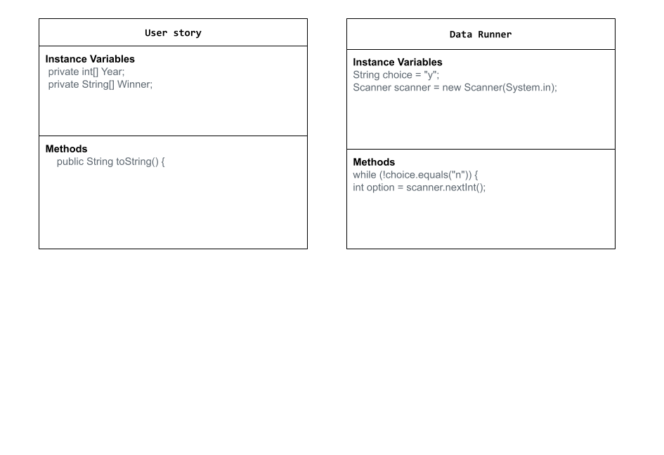

# Unit 3 - Data for Social Good Project 

## Introduction 

Software engineers develop programs to work with data and provide information to a user. Each user has different needs based on the information they are looking for from data. Your goal is to create a data analysis program for your user that stores and analyzes data to provide the information they need. 

## Requirements 

Use your knowledge of object-oriented programming, one-dimensional (1D) arrays, and algorithms to create your data analysis program: 
- **Write a class** – Write a class to represent your user or business and store and analyze their data with no-argument and parameterized constructors. 
- **Create at least two 1D arrays** – Create at least two 1D arrays to store the data that your user needs information about. 
- **Write a method** – Write a method that finds or manipulates the elements in a 1D array to provide the information your user needs. 
- **Implement a toString() method** – Write a toString() method that returns general information about the data (for example, number of values in the dataset). 
- **Document your code** – Use comments to explain the purpose of the methods and code segments and note any preconditions and postconditions. 

## User Story 

> My name is Fabrizio Romano, I’m a soccer journalist that loves to leak important information. My next task is to leak who will win the next world cup, to make things interesting I want to look at who has won it each year so it can be someone new. Can you help me with a data set of           
winners?
 

## Dataset
Kaggle data set link- https://www.kaggle.com/datasets/jahaidulislam/fifa-world-cup-award-winner-1930-2022?select=FIFA+World+Cup+Award+Winner+1930-2022.csv
- **Country** (String) - Uruguay
Italy
Italy
Uruguay
West Germany
Brazil
Brazil
England
Brazil
West Germany
Argentina
Italy
Argentina
West Germany
Brazil
France
Brail
Italy
Spain
Germany
France
Argentina
- **Year** (int) - 1930
1934
1938
1950
1954
1958
1962
1966
1970
1974
1978
1982
1986
1990
1994
1998
2002
2006
2010
2014
2018
2022
## UML Diagram 

## Description 
Our project is for soccer lovers. People who want to know more about the game and the best countries that play it. Fans as well as journalists could use it to predict the best countries that play the sport. The text files used collected data from the data sets from kaggle. These data sets were then used in our methods to be filtered and displayed as an output when the user picks a option from 1-22. We used nesred for-loops to filter the data and then if else statements. We used a toString() using toString() methods we are able to get the primitive values of our array. We also used a nested loop to append our items. The user needs to run the program and then the sata set with the year and the world cup winner of that year will show up. Then the user has to choose a number of the world cup from 1-22. For example if they choose one the first ever world cups winner will be shown. 